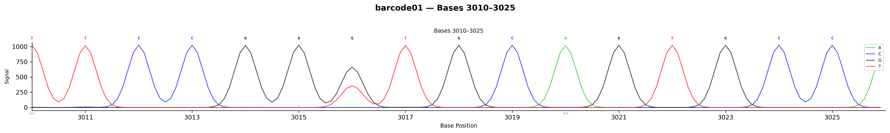

# Analyze Variants (SDVC Algorithm)

ab1tools includes the **Signal Deconvolution-based Variant Calling (SDVC)** algorithm for detecting heterozygous, mosaic, or mixed-population variants directly from chromatogram trace data.

---

## `call` — SDVC variant detection from AB1

```bash
# Mode 1: Control-free (no control needed, LOD ~2-3%)
ab1tools call sample.ab1

# Mode 2: Control-enhanced (with matched control, LOD <1%)
ab1tools call sample.ab1 --control wild_type.ab1

# Custom thresholds
ab1tools call sample.ab1 --threshold 0.03 --sensitivity 0.3

# VCF output for pipeline integration
ab1tools call sample.ab1 --format vcf -o variants.vcf

# With annotated chromatogram
ab1tools call sample.ab1 --plot
```

**Example: variant at position 3016 (G→T, 35% minor allele frequency):**



The mixed peak at position 3016 shows proportional G (black, major) and T (red, minor) signals — exactly as a real Sanger chromatogram would display a heterozygous site.

### The Dual-Mode Innovation

SDVC is the **only chromatogram analysis tool that works both with and without a control trace**:

| Mode | Input | LOD | Use Case |
|------|-------|-----|----------|
| **Mode 1 (Control-free)** | Any single AB1 | ~2-3% | Screening, retrospective analysis, any AB1 file |
| **Mode 2 (Control-enhanced)** | AB1 + control AB1 | <1% | CRISPR validation, clinical confirmation |

All other tools (TIDE, ICE, DECODR, EditR) require a mandatory control trace. SDVC's control-free mode is unique.

### How SDVC Works

```
AB1 trace data (4 channels: A/C/G/T)
    ↓
1. Peak signal extraction (±3 window around peak center)
    ↓
2. Baseline correction (10th percentile of flanking regions)
    ↓
3. Cross-channel normalization → per-base frequencies
    ↓
4. Dynamic thresholding (adapts to local noise level)
    τ = τ₀ + k × (noise_floor / max_signal)
    ↓
5. Confidence scoring: C = (f_minor / f_major) × SNR
    ↓
6. Optional Bayesian prior: posterior ∝ likelihood × prior
    ↓
7. Multi-position consistency (sliding window enhancement)
    ↓
Variant calls with frequencies, confidence, SNR
```

### Parameters

| Parameter | Default | Description |
|-----------|---------|-------------|
| `--threshold` | 0.05 | Minimum minor allele frequency |
| `--sensitivity` | 0.5 | Dynamic threshold sensitivity (lower = more sensitive) |
| `--prior` | 0.01 | Bayesian prior for variant (set 0.5 for known hotspots) |
| `--window-size` | 5 | Multi-position consistency window |
| `--control` | None | Control AB1 for Mode 2 (enhanced sensitivity) |
| `--format` | csv | Output format: csv or vcf |
| `--plot` | off | Generate annotated chromatogram PNG |

### Output formats

**CSV** (default):
```
sample,position,consensus_base,major_base,major_freq_%,minor_base,minor_freq_%,...,is_variant,confidence,snr,threshold
barcode01,3016,T,G,64.9,T,35.1,...,True,0.0228,2.40,0.0500
```

**VCF v4.2**:
```
##fileformat=VCFv4.2
##source=ab1tools_SDVC
#CHROM  POS  ID  REF  ALT  QUAL  FILTER  INFO
barcode01  3016  .  G  T  0  LowConf  AF=0.3510;CONF=0.0228;SNR=2.40
```

### Limit of Detection (LOD) Performance

| True Frequency | Mode 1 (noise=0) | Mode 1 (noise=5) | Mode 2 (noise=5) |
|---------------|-------------------|-------------------|-------------------|
| 1% | Not detected | Not detected | Detected |
| 2% | Detected | Detected | Detected |
| 3% | Detected | Detected | Detected |
| 5% | Detected (5.8%) | Detected (5.9%) | Detected |
| 10% | Detected (11.6%) | Detected (11.6%) | Detected |
| 20% | Detected (23.1%) | Detected (22.9%) | Detected |

### Use cases

**CRISPR editing efficiency:**
```bash
# Generate AB1 from edited amplicon reads
ab1tools single --bam edited.bam --consensus reference.fa -o output/
# Detect editing at target site
ab1tools call output/edited_sample.ab1 --threshold 0.03
```

**Clinical variant confirmation:**
```bash
# With control for maximum sensitivity
ab1tools call patient_sample.ab1 --control normal_control.ab1 --format vcf
```

**Retrospective analysis of Sanger archives:**
```bash
# No control needed — analyze any existing AB1 file
ab1tools call old_sanger_data.ab1 --threshold 0.05
```

---

## `stats` — Trace quality statistics

Compute comprehensive quality metrics from any AB1 file.

```bash
ab1tools stats sample.ab1
ab1tools stats sample.ab1 --format csv -o quality_report.csv
ab1tools stats sample.ab1 --format json
```

### Output metrics

| Metric | Description |
|--------|-------------|
| Mean quality | Average phred-like quality across all positions |
| Median quality | Median Q score |
| Q20 % | Percentage of bases with Q >= 20 |
| Q30 % | Percentage of bases with Q >= 30 |
| Mean SNR | Average signal-to-noise ratio |
| Mean peak height | Average dominant channel intensity |
| Peak range | Min-max peak height range |

### Per-position CSV output

When using `--format csv`, the output includes per-position data:

```csv
position,base,quality,snr,peak_height,signal_A,signal_C,signal_G,signal_T
1,A,27,1024.0,1024,1024,2,0,0
2,C,27,1024.0,1024,2,1024,0,2
...
```

This enables downstream analysis: plot quality curves, identify low-quality regions, or feed into custom QC pipelines.

### Use cases

- **Quality control** before variant calling
- **Batch QC** across many samples (script `ab1tools stats` in a loop)
- **Compare** real Sanger vs simulated AB1 quality profiles
