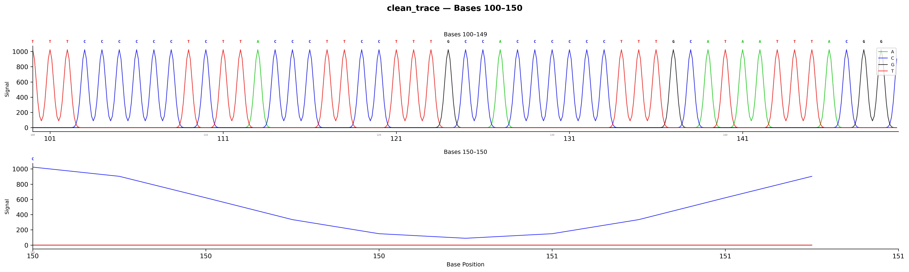
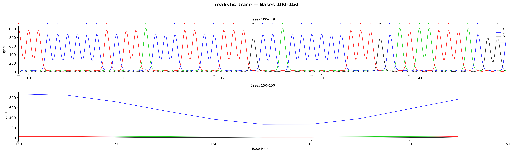

# Signal Parameters Guide

ab1tools generates 4-channel chromatogram signals using Gaussian peak modeling with configurable realism parameters. This page explains each parameter and how to tune them for different use cases.

---

## The Signal Model

For each base b at position i, the trace signal is:

```
S_b(x) = Σ_i  f_i(b) × scale × G(x; μ_i, σ) + ε(x)
```

Where:
- `f_i(b)` = frequency of base b at position i (from BAM pileup or 100% for from-seq)
- `scale` = peak amplitude (default 1024)
- `G(x; μ, σ)` = Gaussian function with center μ and width σ
- `ε(x)` = additive noise

Peak centers are spaced at regular intervals (default 10 trace points).

---

## Parameters

### `--spacing` (default: 10)

Points between peak centers in the trace. Controls the "resolution" of the chromatogram.

| Value | Effect | When to Use |
|-------|--------|-------------|
| 10 | Standard (matches real Sanger) | Default — recommended |
| 5 | Compressed (shorter traces) | Very long sequences (>6000 bp) |
| 15 | Wide spacing | Zoomed-in appearance |

**Note:** If `n_bases × spacing > 65535`, spacing is automatically reduced (AB1 peak positions are uint16).

### `--sigma` (default: 2.0)

Gaussian peak width (standard deviation). Controls peak sharpness.

| Value | Effect |
|-------|--------|
| 1.0 | Very sharp, narrow peaks |
| 2.0 | Standard Sanger-like (recommended) |
| 3.0 | Broader, overlapping peaks |

### `--scale` (default: 1024)

Maximum peak amplitude. The dominant base at each position gets `scale × frequency` height.

| Value | Effect |
|-------|--------|
| 512 | Lower amplitude (quieter signal) |
| 1024 | Standard (recommended) |
| 2048 | Higher amplitude |

### `--noise` (default: 0)

Additive Gaussian white noise level (standard deviation).

| Value | Effect | Appearance |
|-------|--------|-----------|
| 0 | No noise (clean) | Perfectly smooth peaks |
| 3 | Subtle noise | Barely visible jitter |
| 5 | Mild noise | Realistic Sanger-like |
| 10 | Moderate noise | Noisy but readable |
| 20 | Heavy noise | Degraded signal quality |

**Recommendation:** Use `--noise 5` for realistic Sanger appearance.

### `--phasing` (default: 0.0)

Simulates signal carryover (phasing/pre-phasing) from incomplete dye terminator extension. Each point's signal bleeds into the next.

```
S(x) = S(x) + α × S(x-1)
```

| Value | Effect |
|-------|--------|
| 0.0 | No phasing (clean) |
| 0.05 | Subtle tailing |
| 0.1 | Mild tailing (realistic) |
| 0.2 | Strong tailing |

**Recommendation:** Use `--phasing 0.1` for realistic Sanger appearance.

### `--decay` (default: 0.0)

Exponential signal decay modeling the characteristic amplitude drop in Sanger reads. Real Sanger traces lose signal strength toward the end of the read.

```
A_i = A_0 × exp(-λ × i / n)
```

| Value | Effect | Signal at End |
|-------|--------|---------------|
| 0.0 | No decay (uniform) | 100% |
| 0.5 | Mild decay | ~60% |
| 1.0 | Moderate decay | ~37% |
| 2.0 | Strong decay | ~13% |

**Recommendation:** Use `--decay 0.5` for realistic Sanger appearance.

### `--min-mapq` (default: 20)

Minimum mapping quality filter for BAM pileup reads. Only applies to `single`, `batch`, and `smart` modes.

| Value | Effect |
|-------|--------|
| 0 | Include all reads (including poorly mapped) |
| 20 | Standard filter (recommended) |
| 30 | Strict filter |
| 60 | Very strict (unique mappings only) |

### `--no-plot`

Skip PNG generation, produce AB1 files only. Useful for batch processing where PNGs are not needed.

---

## Recommended Presets

### Clean (default)
```bash
ab1tools single --bam aligned.bam --consensus ref.fa -o output/
# spacing=10, sigma=2.0, scale=1024, noise=0, phasing=0, decay=0
```
Sharp, uniform peaks. Good for computational analysis.

**Clean trace (bases 100-150):**



### Realistic Sanger (basic)
```bash
ab1tools single --bam aligned.bam --consensus ref.fa -o output/ \
    --noise 5 --phasing 0.1 --decay 0.5
```
Mimics real ABI 3730 output with noise, tailing, and decay.

### Realistic Sanger (full, recommended for publication)
```bash
ab1tools single --bam aligned.bam --consensus ref.fa -o output/ \
    --noise 5 --phasing 0.1 --decay 0.5 \
    --asymmetry 1.3 --dye-scaling '0.80,1.00,0.95,0.85' \
    --crosstalk 0.03 --baseline-drift 15 --smooth 1.0
```
Full realism: asymmetric peaks (EMG), dye-specific scaling, spectral crosstalk, baseline drift, and smoothing. Most Sanger-like output for publication figures.

**Realistic trace (same region, all Phase 1 features):**



Note the differences: unequal channel amplitudes (dye scaling), slightly broader peaks (asymmetry + smoothing), and subtle baseline wandering (drift). Base calls remain identical.

### Old Sequencer / Long Read
```bash
ab1tools single --bam aligned.bam --consensus ref.fa -o output/ \
    --noise 10 --phasing 0.15 --decay 2.0 --asymmetry 1.5
```
Strong decay, noise, and peak asymmetry. Simulates degraded or end-of-read signal.

### High-Quality Short Region
```bash
ab1tools single --bam aligned.bam --consensus ref.fa -o output/ \
    --noise 2 --phasing 0.05 --decay 0.1 --smooth 0.5
```
Clean signal with minimal artifacts and subtle smoothing.

---

## Feature Impact Comparison

Each Phase 1 feature's effect on the generated signal (barcode01, 3788 bp):

| Feature | Parameter | A_max | C_max | G_max | T_max | Corr vs Clean |
|---------|-----------|-------|-------|-------|-------|---------------|
| Clean (control) | *(none)* | 1024 | 1024 | 1024 | 1024 | 1.0000 |
| Asymmetric peaks | `--asymmetry 1.3` | 1024 | 1024 | 1024 | 1024 | 0.9871 |
| Dye scaling | `--dye-scaling 0.80,1.00,0.95,0.85` | 1024 | 870 | 819 | 972 | 1.0000 |
| Crosstalk | `--crosstalk 0.03` | 1024 | 1024 | 1024 | 1024 | 0.9994 |
| Baseline drift | `--baseline-drift 15` | 1038 | 1038 | 1038 | 1038 | 0.9996 |
| Smoothing | `--smooth 1.0` | 961 | 915 | 915 | 915 | 0.9962 |
| **All combined** | *full preset* | **1033** | **889** | **809** | **987** | **0.9588** |

**Key findings:**
- All base calls remain 100% identical under all signal effects
- SDVC variant detection LOD is unchanged (2% with all features enabled)
- Dye scaling has the largest amplitude effect (matches real ABI BigDye chemistry)
- Asymmetric peaks have the largest shape effect (r=0.9871)
